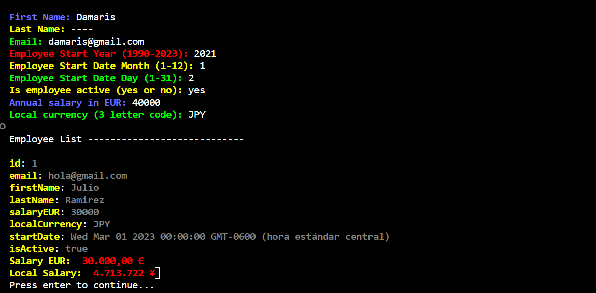

# employee-management

<a name="readme-top"></a>

<div align="center">
    
  <br/>
  <h3><b>Employee Management</b></h3>

</div>
<!-- TABLE OF CONTENTS -->
# 📗 Table of Contents

- [employee-management](#employee-management)
- [📗 Table of Contents](#-table-of-contents)
- [📖Employee Management ](#employee-management-)
  - [🛠 Built With ](#-built-with-)
    - [Tech Stack ](#tech-stack-)
    - [Key Features ](#key-features-)
  - [🚀 Live Demo ](#-live-demo-)
  - [💻 Getting Started ](#-getting-started-)
    - [Prerequisites](#prerequisites)
    - [Setup](#setup)
    - [Install](#install)
    - [Usage](#usage)
    - [Run tests](#run-tests)
    - [Deployment ](#deployment-)
  - [👥 Author ](#-author-)
  - [🔭 Future Features ](#-future-features-)
  - [🤝 Contributing ](#-contributing-)
  - [⭐️ Show your support ](#️-show-your-support-)
  - [🙏 Acknowledgments ](#-acknowledgments-)
  - [❓ FAQ ](#-faq-)
  - [📝 License ](#-license-)

<!-- PROJECT DESCRIPTION -->

# 📖Employee Management <a name="about-project"></a>

"Employee Management" is an employee management CLI that allows you to add, list and search by id.

## 🛠 Built With <a name="built-with"></a>
HTML,
CSS,
JavaScript.

### Tech Stack <a name="tech-stack"></a>

<details>
  <summary>Client</summary>
  <ul>
    <li><a href="https://developer.mozilla.org/en-US/docs/Web/HTML">HTML</a></li>
    <li><a href="https://developer.mozilla.org/en-US/docs/Web/CSS">CSS</a></li>
    <li><a href="https://developer.mozilla.org/en-US/docs/Web/JavaScript">JavaScript</a></li>
  </ul>
</details>

<details>
  <summary>Package Manager</summary>
  <ul>
    <li><a href="https://www.npmjs.com/">npm</a></li>
  </ul>
</details>

<!-- Features -->

### Key Features <a name="key-features"></a>

- **It allows to add, search and list employees.**
- **Fetch data from API to get currency value.**

<p align="right">(<a href="#readme-top">back to top</a>)</p>

<!-- LIVE DEMO -->

## 🚀 Live Demo <a name="live-demo"></a>

- It will be available soon.

<p align="right">(<a href="#readme-top">back to top</a>)</p>

<!-- GETTING STARTED -->

## 💻 Getting Started <a name="getting-started"></a>

To get a local copy up and running, follow these steps.

### Prerequisites

In order to run this project you need:

- An IDE e.g [Visual studio code](https://code.visualstudio.com/).
- `node` should be installed in your local machine, [node website](https://nodejs.org/en/download/).
- Install the `npm` package manager use this [to install both node and npm](https://docs.npmjs.com/downloading-and-installing-node-js-and-npm).
- [A terminal](https://code.visualstudio.com/docs/terminal/basics).

### Setup

Clone this repository to your desired folder or download the Zip folder:

```
https://github.com/Alejandroq12/employee-management.git
```

- Navigate to the location of the folder in your machine:

**``you@your-Pc-name:~$ cd employee-management``**

### Install

To install all dependencies, run:

```
npm install

```

### Usage

To run the project, follow these instructions(make sure to be in the root folder):

To add an employee:
```
node index.js add

```

To list employees:
```
node index.js list

```

To search by ID:
```
node index.js search-by-id

```

To search by name:
```
node index.js search-by-name

```

### Run tests

To run tests, run the following command:

```
npx eslint .
```

### Deployment <a name="deployment"></a>

- It will be available in the future. Thank you for your patience.

<p align="right">(<a href="#readme-top">back to top</a>)</p>

<!-- AUTHORS -->

## 👥 Author <a name="authors"></a>

👤 **Julio Quezada**

- GitHub: [Alejandroq12](https://github.com/Alejandroq12)
- Twitter: [@JulioAle54](https://twitter.com/JulioAle54)
- LinkedIn: [Julio Quezada](https://www.linkedin.com/in/quezadajulio/)

<p align="right">(<a href="#readme-top">back to top</a>)</p>

<!-- FUTURE FEATURES -->

## 🔭 Future Features <a name="future-features"></a>

- [ ] **I will allow to erase users.**
- [ ] **I will add validations.**

<p align="right">(<a href="#readme-top">back to top</a>)</p>

<!-- CONTRIBUTING -->

## 🤝 Contributing <a name="contributing"></a>

Contributions, issues, and feature requests are welcome!

Feel free to check the [issues page](../../issues/).

<p align="right">(<a href="#readme-top">back to top</a>)</p>

<!-- SUPPORT -->

## ⭐️ Show your support <a name="support"></a>

If you like this project give me a star ⭐️

<p align="right">(<a href="#readme-top">back to top</a>)</p>

<!-- ACKNOWLEDGEMENTS -->

## 🙏 Acknowledgments <a name="acknowledgements"></a>

-----------

<p align="right">(<a href="#readme-top">back to top</a>)</p>

<!-- FAQ  -->

## ❓ FAQ <a name="faq"></a>

- **Why did you code this project?**

  - Because I want to master JavaScript.

<p align="right">(<a href="#readme-top">back to top</a>)</p>

<!-- LICENSE -->

## 📝 License <a name="license"></a>

This project is [LICENSE](./LICENSE) licensed.

<p align="right">(<a href="#readme-top">back to top</a>)</p>